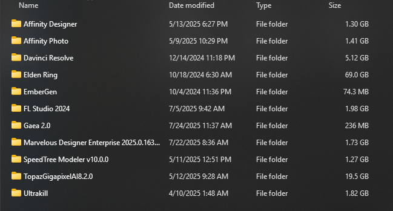

# Markdown Experiment 1

* In this experiment, I will be exploring the different features introduced by the [CS3 Markdown Playground](https://roycan.github.io/cs3-markdown-playground)
* Coming from C++, the straightforward style of markdown is unfamiliar to me.

>> ### If my eyes turn run, red

I actually started with C++ as my first coding language; I originally wanted to create physics simulations with them. I still don't know how, but here's a code snippet from a rudimentary pathtracer I made (which is the closest thing I can get to "physics engine")

```cpp
RGB fresnelSchlick(float cosTheta, const RGB& F0) {
	float powTerm = pow(1.0f - std::max(cosTheta, 0.0f), 5.0f);
	return (F0 + (RGB{ 1.0f, 1.0f, 1.0f } - F0)) * powTerm;
}
```

I like it because it explains why marble floors only appear shiny when you view them close to the ground: *reflections get stronger the lower the viewing angle is*

Discord text formatting is kinda similar to this, maybe that's because many devs use discord as their means of communication?



I've cracked many 3D applications because I'm broke and don't have any money. Luckily for me, [Blender](https://blender.org/) is completely free and one of the best softwares out there. Go try it now!!!

